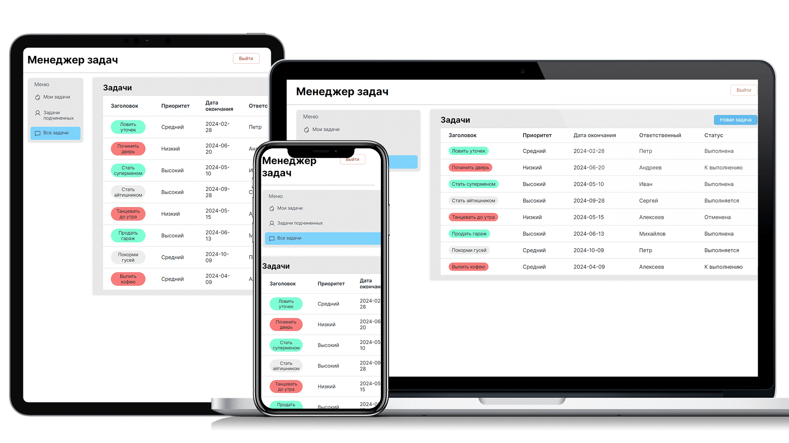

# Task Manager

## Описание

Этот репозиторий содержит как **Frontend**, так и **Backend** части приложения **Task Manager**, а также конфигурационные файлы для **Docker**.

- `Backend` часть приложения написана на **NestJS**, **TypeORM** и подключена к базе данных **MySQL**.
- `Frontend` часть приложения написана на **React** и **Vite**.
- Для полного запуска и пользования приложением используйте `Docker`.

**Task Manager** представляет собой менеджер задач для персонала, позволяющий создавать, редактировать и удалять задачи, а также назначать задачи сотрудникам. Присутствует иерархия задач, которая позволяет руководителю назначать задачи своим подчиненным.
Подчиненные не могут назначать задачи своему руководителю. Также подчиненные не могут редактировать задачи, которые создали их руководители.

При любой попытке доступа к системе пользователь сперва проходит процесс авторизации.

## Скриншот



### Страница авторизации

На странице авторизации отображается форма с двумя текстовыми полями: логином и паролем. После ввода данных и успешной проверки пользователь перенаправляется на страницу с задачами. При неуспешной попытке авторизации отображается одна из возможных ошибок: "Пользователь с таким логином не существует" или "Пользователь ввел неверный пароль".

### Страница с задачами

На странице с задачами отображается список задач с возможностью группировки по следующим критериям:

- **По дате завершения**:
  - Задачи на сегодня
  - Задачи на неделю
  - Задачи на будущее (больше чем на неделю)
- **По ответственным** (режим просмотра для руководителя):

  - Задачи, сгруппированные по ответственным сотрудникам

- **Без группировок**:
  - Список всех задач, отсортированных по дате последнего обновления

Заголовки незавершенных задач с датой окончания менее текущей даты отображаются красным цветом. Заголовки завершенных задач отображаются зеленым цветом. Остальные задачи - серым.

### Данные для авторизации

- **Пароль для всех пользователей**:
  - 123
- **Логины пользователей**:
  - ivanov
  - petrovich
  - serega
  - alex
  - michalych
  - andry

## Установка и запуск

### Использование Docker Compose

Для запуска всех сервисов и работы с ними используйте **Docke**:

1. Убедитесь, что у вас установлены **Docker**.
2. Запустите Docker Compose из корня репозитория, где расположен файл docker-compose.yml:
   ```bash
   docker-compose up --build
   ```
3. Начните пользование приложением, доступы указаны ниже.

### Запуск проекта без Docker

Если вы запускаете приложения отдельно без **Docker**, то необходимо создать файлы окружения **.env**.
Бэкенд часть приложения запускается с помощью команды:

```bash
npm ci
npm run start
```

Фронтенд часть приложения запускается с помощью команды:

```bash
npm ci
npm run start
```

Отдельно нужно запустить базу данных MySQL.

### Доступ

1. Frontend: http://localhost:3000
2. Backend: http://localhost:3500
3. phpMyAdmin: http://localhost:8080
4. MySQL Database: http://localhost:3306

### Структура репозитория

- `backend/`: Директория с исходным кодом бэкенда и Dockerfile.
- `frontend/`: Директория с исходным кодом фронтенда и Dockerfile.
- `docker-compose.yml`: Конфигурационный файл для Docker Compose.

### Если вы запускаете приложения отдельно без Docker Compose, то необходимо создать файлы окружения и доступы

Создайте файл .env в директориях backend и frontend и добавьте в них следующие параметры:

#### В директории Backend .env

```
PORT=3500
MYSQL_HOST=db
MYSQL_PORT=3306
MYSQL_USERNAME=root
MYSQL_PASSWORD=root
MYSQL_DATABASE=task-manager
```

#### В директории Frontend .env

```
VITE_APP_BASE_URL=http://localhost:3500
```
